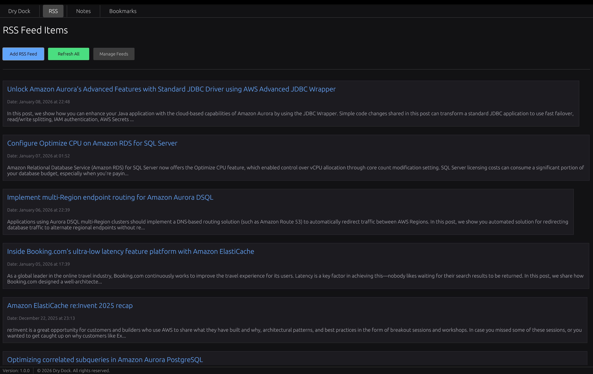
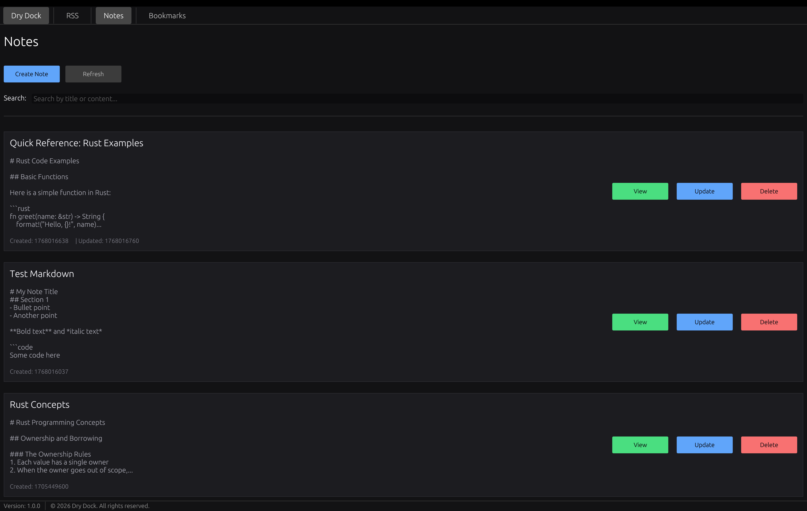
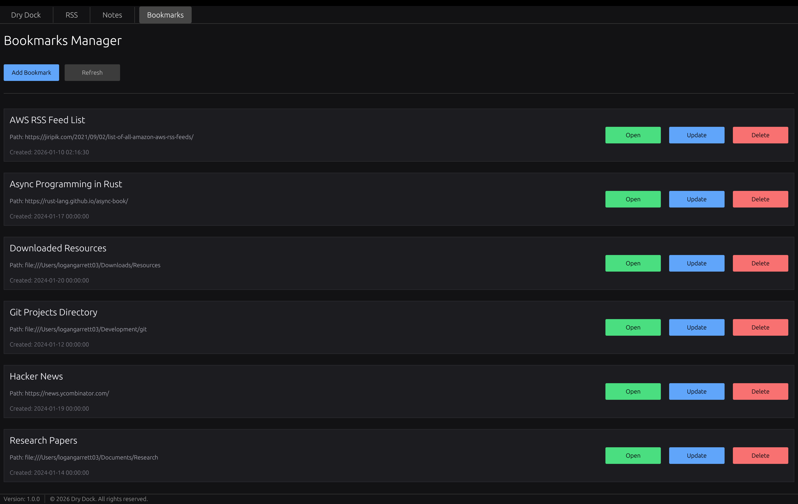

# Dry Dock 🚢

A modern personal productivity application built with Rust and egui. Manage your bookmarks, notes, and RSS feeds in one beautiful dark-themed interface.More to come such as local llama assistant, settings control, and more!

## Features

- **📚 Bookmarks Manager**: Save and organize your favorite web links and folder paths.
- **📝 Notes**: Create and manage personal notes.
- **📰 RSS Feeds**: Subscribe to and see RSS/Atom feeds as they publish. (Reloads every 5 Minutes)
- **🎨 Dark Theme**: High Contrast dark mode.
- **💾 Local SQLite Database**: All your data stays on your machine.

## Screenshots








## Installation

### Build from Source (Quick Install)

The easiest way to build and install from source:

```bash
# Clone the repository
git clone https://github.com/logangarrett03/dry-dock.git
cd dry-dock

# Run the automated build and install script
./build-and-install.sh
```

The script will:
- Build the release version with optimizations
- Bundle it as a macOS .app
- Install it to `/Applications/Dry Dock.app`
- Remove quarantine attributes
- Offer to launch the app

## Usage

### Getting Started

1. **Launch Dry Dock** from your Applications folder
2. Use the **navigation menu** at the top to switch between features:
   - **Home** - Welcome screen
   - **Bookmarks** - Manage your saved links
   - **Notes** - Create and organize notes
   - **Feeds** - Subscribe to RSS/Atom feeds

### Managing Bookmarks

- Click **"Add Bookmark"** to save a new link
- Enter the URL, title, and optional description
- View all bookmarks in a clean card layout
- Delete bookmarks with the **"Delete"** button

### Creating Notes

- Click **"Create Note"** to write a new note
- Add a title and detailed content
- Notes are displayed with creation/update timestamps
- Delete notes you no longer need

### RSS Feeds

- Click **"Add Feed"** to subscribe to an RSS/Atom feed
- Enter the feed URL (http/https will be auto-added if missing)
- Click **"Refresh All Feeds"** to fetch latest articles
- Browse articles with titles, descriptions, and publication dates
- Click **"Open Link"** to read the full article in your browser

## Data Storage

Dry Dock stores all data locally in a SQLite database:

```
~/Library/Application Support/DryDock/database.db
```

Your data never leaves your machine and is completely private.

## Building for Development

```bash
cd dry-dock
cargo build        # Debug build
cargo run          # Run in debug mode
cargo build --release  # Optimized release build
```

## Architecture

Dry Dock follows a clean **3-tier architecture**:

1. **UI Layer** - Screens and modals (presentation)
2. **Service Layer** - Business logic, validation, data transformation
3. **Data Access Layer** - Repository pattern for database operations

This separation ensures maintainability, testability, and clear separation of concerns.

## Contributing

Contributions are welcome! Please feel free to submit a Pull Request.

1. Fork the repository
2. Create your feature branch (`git checkout -b feature/amazing-feature`)
3. Commit your changes (`git commit -m 'Add some amazing feature'`)
4. Push to the branch (`git push origin feature/amazing-feature`)
5. Open a Pull Request

## License

This project is licensed under a Custom License - see the [LICENSE.md](LICENSE.md) file for details.

## Author

**Logan Garrett**

- GitHub: [@logan-garrett](https://github.com/logan-garrett)

---

**Dry Dock** - Your personal harbor for knowledge and productivity 🚢
